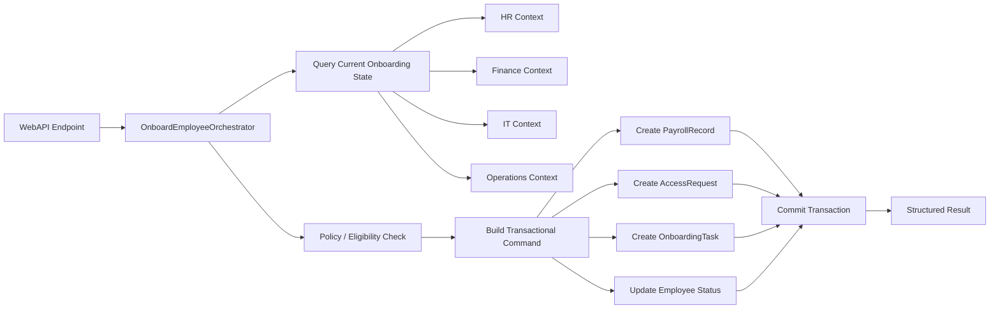

# DataArc Orchestration Framework

> A WebAPI demo showing how DataArc orchestration coordinates a complete use-case workflow across application rules, persistence boundaries, and transactional EF Core execution.

**DataArc Orchestration Framework** provides an explicit orchestration layer for application workflows.

This demo shows a human-resources onboarding workflow exposed through a small ASP.NET Core WebAPI. The goal is to show how a use case can be coordinated through a named orchestrator instead of spreading the flow across controllers, services, repositories, handlers, and ad hoc transaction code.

The demo focuses on the V1 public product story:

```text
Receive an API request.
Load the current employee onboarding state.
Apply policy/eligibility rules.
Create onboarding records across isolated EF Core contexts.
Update the employee onboarding status.
Commit the workflow through one transactional command path.
Return a structured orchestration result.
```

---

## What This Demo Shows

The demo is intentionally focused on one clean orchestration path.

It demonstrates:

1. **Named workflow orchestration**  
   A use case is represented by an orchestrator instead of being hidden inside controller or service plumbing.

2. **Application rules outside the controller**  
   The WebAPI endpoint accepts the request and delegates the workflow. Business decisions stay in application/orchestration code.

3. **Explicit EF Core execution boundaries**  
   EF Core work is routed through DataArc execution contexts instead of direct `DbContext` injection in application services.

4. **Query-first workflow state loading**  
   The orchestrator reads the current onboarding state before deciding whether the workflow can continue.

5. **Policy-driven validation**  
   Employee eligibility and onboarding status checks are kept visible and testable.

6. **Single transactional write path**  
   The onboarding workflow creates the required records and updates employee status through one command builder and one transaction commit.

7. **Structured orchestration output**  
   The API receives a clear success/failure result from the orchestration flow.

The central idea:

```text
Controllers receive requests.
Orchestrators coordinate workflows.
Policies decide whether work may continue.
DataArc execution contexts route persistence work.
Command/query factories build the EF Core execution pipeline.
Structured results leave the workflow.
```

---

## Demo Scope

This is a **single WebAPI orchestration demo**.

It is not a distributed host-to-api/event-bus sample. The WebAPI hosts the endpoint and runs the orchestration flow inside the application process.

For systems where an external worker host and WebAPI need to communicate across process boundaries, a message bus or event-based integration can be added by the consuming application. That distributed hosting pattern is outside this public V1 demo.

The demo stays focused on the core framework story:

> Coordinate a workflow explicitly, route persistence through DataArc, and keep the controller thin.

---

## Domain Scenario

The demo models an employee onboarding use case.

The participating persistence boundaries are:

```text
HR
Finance
IT
Operations
```

The onboarding flow works with these records:

```text
Employee              -> HR context
PayrollRecord         -> Finance context
AccessRequest         -> IT context
OnboardingTask        -> Operations context
```

The demo uses `EmployeeId` as the cross-context correlation key.

That keeps the public workflow easy to understand:

```text
HR owns the employee.
Finance creates the payroll record for that employee.
IT creates the access request for that employee.
Operations creates the onboarding task for that employee.
HR updates the employee onboarding status.
```

---

## High-Level Workflow

The onboarding endpoint receives a request similar to:

```json
{
  "employeeId": 1,
  "annualSalary": 85000,
  "currencyCode": "USD",
  "reason": "Demo employee onboarding"
}
```

The orchestrator then performs the workflow:

1. Read employee onboarding state from HR.
2. Load any existing Finance payroll record for the employee.
3. Load any existing IT access request for the employee.
4. Load any existing Operations onboarding task for the employee.
5. Reject the request if the employee does not exist.
6. Reject the request if onboarding has already been completed or related records already exist.
7. Create a Finance payroll record.
8. Create an IT access request.
9. Create an Operations onboarding task.
10. Update the employee onboarding status.
11. Commit all writes through one transactional command path.
12. Return the orchestration result to the API.



---

## Orchestrator Shape

The orchestrator owns the use-case flow.

It reads state, validates the request, builds the persistence commands, commits the workflow, and returns an output model.

Conceptual shape:

```csharp
public sealed class OnboardEmployeeOrchestrator
{
    public async Task<OnboardEmployeeOutput> ExecuteAsync(OnboardEmployeeInput input)
    {
        var employeeOnboardingState = await LoadEmployeeOnboardingStateAsync(input);

        if (employeeOnboardingState.Employee is null)
        {
            return OnboardEmployeeOutput.Failed("Employee was not found.");
        }

        if (!CanStartOnboarding(employeeOnboardingState))
        {
            return OnboardEmployeeOutput.Failed("Employee has already been onboarded.");
        }

        var payrollRecord = CreatePayrollRecord(input);
        var accessRequest = CreateAccessRequest(input);
        var onboardingTask = CreateOnboardingTask(input);

        employeeOnboardingState.Employee.OnBoardingStatus = "Onboarded";

        var commandBuilder = await _commandFactory.CreateCommandBuilderAsync();

        commandBuilder
            .UseDbExecutionContext<IFinanceDbContext>()
            .Add(payrollRecord);

        commandBuilder
            .UseDbExecutionContext<IItDbContext>()
            .Add(accessRequest);

        commandBuilder
            .UseDbExecutionContext<IOperationsDbContext>()
            .Add(onboardingTask);

        commandBuilder
            .UseDbExecutionContext<IHrDbContext>()
            .Update(employeeOnboardingState.Employee);

        var command = await commandBuilder.BuildAsync();
        var result = await command.CommitTransactionAsync();

        return result.Success
            ? OnboardEmployeeOutput.Success(input.EmployeeId)
            : OnboardEmployeeOutput.Failed(result.Message);
    }
}
```

The important part is not the exact DTO names. The important part is the execution model:

```text
Load state.
Decide.
Build commands.
Commit once.
Return a structured result.
```

---

## Query Pipeline Shape

The onboarding state is loaded through DataArc query execution.

The orchestrator reads the employee from HR and left-joins related records by `EmployeeId`.

Conceptual shape:

```csharp
var employeeOnboardingStates = await employeeOnboardingStateQuery
    .UseDbExecutionContext<IHrDbContext, Employee>(employee =>
        employee.Id == input.EmployeeId)
    .JoinLeft<IFinanceDbContext, PayrollRecord>(
        bag => bag.Get<Employee>()!.Id,
        payrollRecord => payrollRecord.EmployeeId)
    .JoinLeft<IItDbContext, AccessRequest>(
        bag => bag.Get<Employee>()!.Id,
        accessRequest => accessRequest.EmployeeId)
    .JoinLeft<IOperationsDbContext, OnboardingTask>(
        bag => bag.Get<Employee>()!.Id,
        onboardingTask => onboardingTask.EmployeeId)
    .Select(bag => new
    {
        Employee = bag.Get<Employee>(),
        PayrollRecord = bag.Get<PayrollRecord>(),
        AccessRequest = bag.Get<AccessRequest>(),
        OnboardingTask = bag.Get<OnboardingTask>()
    })
    .ToListAsync();
```

This is used to understand whether the workflow can continue. The write path remains explicit and transactional.

---

## Command Pipeline Shape

The onboarding write path is built through one command builder.

```csharp
onboardingCommandBuilder
    .UseDbExecutionContext<IFinanceDbContext>()
    .Add(payrollRecord);

onboardingCommandBuilder
    .UseDbExecutionContext<IItDbContext>()
    .Add(accessRequest);

onboardingCommandBuilder
    .UseDbExecutionContext<IOperationsDbContext>()
    .Add(onboardingTask);

onboardingCommandBuilder
    .UseDbExecutionContext<IHrDbContext>()
    .Update(employeeOnboardingState.Employee);

var onboardingCommand = await onboardingCommandBuilder.BuildAsync();
var onboardingResult = await onboardingCommand.CommitTransactionAsync();
```

The repeated `UseDbExecutionContext<T>()` calls are intentional.

Each persistence boundary is visible at the call site. The workflow does not rely on hidden repository state, ambient unit-of-work assumptions, or controller-level transaction plumbing.

---

## Policy Shape

The policy is intentionally simple.

It focuses on employee eligibility and onboarding status.

Example rule direction:

```text
If the employee does not exist, reject.
If the employee is already onboarded, reject.
If related onboarding records already exist, reject.
Otherwise allow onboarding.
```

The detailed existence checks belong in the orchestrator because they come from the cross-context state load.

The policy remains focused on the business decision.

---

## Why This Matters

Many application workflows become hard to follow because orchestration is spread across too many places:

```text
Controller
Service
Repository A
Repository B
Repository C
Unit of Work
Handler
Event
Another Handler
```

DataArc Orchestration Framework gives the workflow a clear home.

The orchestrator expresses the use case directly:

```text
What state is needed?
What rule decides whether the workflow can continue?
What writes need to happen?
Which persistence boundary owns each write?
What result leaves the workflow?
```

This demo is not claiming that the same workflow cannot be built manually.

The point is consistency:

> You can build this manually. DataArc gives you a repeatable execution model for doing it explicitly across application, orchestration, and EF Core persistence boundaries.

---

## Project Structure

The solution keeps orchestration, application use cases, persistence, host wiring, and WebAPI entry points in separate projects so the flow stays visible.

```text
DataArc.Orchestration.Framework
│
├── DataArc.Orchestration.Framework.Demo.Application
│   └── Application registration and shared application wiring
│
├── DataArc.Orchestration.Framework.Demo.Application.Domain
│   └── Domain models and domain-facing concepts
│
├── DataArc.Orchestration.Framework.Demo.Application.Domain.SharedKernel
│   └── Shared domain primitives and common domain types
│
├── DataArc.Orchestration.Framework.Demo.Application.Features
│   └── Feature-level contracts and feature service boundaries
│
├── DataArc.Orchestration.Framework.Demo.Application.Modules
│   └── Application module registration and module-level wiring
│
├── DataArc.Orchestration.Framework.Demo.Application.Orchestration
│   └── Orchestration inputs, outputs, policies, and orchestration contracts
│
├── DataArc.Orchestration.Framework.Demo.Application.UseCases
│   └── Use-case implementation and workflow-facing application code
│
├── DataArc.Orchestration.Framework.Demo.Host
│   └── Host-level setup for demo execution scenarios
│
├── DataArc.Orchestration.Framework.Demo.Orchestration
│   └── Concrete orchestrator implementations
│
├── DataArc.Orchestration.Framework.Demo.Persistence
│   └── EF Core contexts, execution-context contracts, database setup, and persistence registration
│
└── DataArc.Orchestration.Framework.Demo.WebApi
    └── ASP.NET Core API entry point, Swagger setup, controllers, and request/response surface
```

This structure is more explicit than a tiny sample because the demo is meant to show where orchestration fits in a real application shape.

---

## Startup Project

When running from Visual Studio, set the startup project to:

```text
DataArc.Orchestration.Framework.Demo.WebApi
```

The repository may include Visual Studio solution launch settings so the WebAPI starts by default. IDE-specific startup settings can vary per machine, so the README states the startup project explicitly.

From the command line:

```bash
dotnet run --project DataArc.Orchestration.Framework.Demo.WebApi --framework net8.0
```

---

## Running The Demo

### 1. Configure connection strings

Update the SQL Server connection strings in the WebAPI `appsettings.json`.

Use local SQL Server, SQL Server Developer Edition, or another SQL Server instance you control.

Example shape:

```json
{
  "ConnectionStrings": {
    "HrDb": "Server=YOUR_SERVER;Database=DataArcOrchestrationFrameworkDemo_HrDb;Integrated Security=true;TrustServerCertificate=True;",
    "FinanceDb": "Server=YOUR_SERVER;Database=DataArcOrchestrationFrameworkDemo_FinanceDb;Integrated Security=true;TrustServerCertificate=True;",
    "ItDb": "Server=YOUR_SERVER;Database=DataArcOrchestrationFrameworkDemo_ItDb;Integrated Security=true;TrustServerCertificate=True;",
    "OperationsDb": "Server=YOUR_SERVER;Database=DataArcOrchestrationFrameworkDemo_OperationsDb;Integrated Security=true;TrustServerCertificate=True;"
  }
}
```

### 2. Run the WebAPI

From Visual Studio, run the WebAPI startup project.

From the command line:

```bash
dotnet run --project DataArc.Orchestration.Framework.Demo.WebApi --framework net8.0
```

### 3. Open Swagger

After the WebAPI starts, open the Swagger UI URL printed by ASP.NET Core.

Typical local URLs look like:

```text
https://localhost:PORT/swagger
http://localhost:PORT/swagger
```

The exact port depends on your local launch settings.

### 4. Create or import demo data

Use the HR import endpoint to create demo data.

Example endpoint shape:

```text
POST /api/hr/imports
```

Expected response shape:

```json
{
  "totalRecordsProcessed": 100000,
  "errors": []
}
```

### 5. Run employee onboarding

Use the onboarding endpoint from Swagger.

Example request shape:

```json
{
  "employeeId": 1,
  "annualSalary": 85000,
  "currencyCode": "USD",
  "reason": "Demo employee onboarding"
}
```

Expected result:

```text
The API returns a structured orchestration response indicating whether onboarding succeeded or why it was rejected.
```

---

## DataArc Registration

The WebAPI registers DataArc Core, EntityFrameworkCore execution contexts, and the Orchestration Framework.

The conceptual registration shape is:

```csharp
services.AddDataArcCore();

services.ConfigureDataArc(dataArc =>
{
    dataArc.UseEntityFrameworkCore(ef =>
    {
        ef.AddDbExecutionContext<IHrDbContext, HrDbContext>(options =>
            options.UseSqlServer(hrConnectionString));

        ef.AddDbExecutionContext<IFinanceDbContext, FinanceDbContext>(options =>
            options.UseSqlServer(financeConnectionString));

        ef.AddDbExecutionContext<IItDbContext, ItDbContext>(options =>
            options.UseSqlServer(itConnectionString));

        ef.AddDbExecutionContext<IOperationsDbContext, OperationsDbContext>(options =>
            options.UseSqlServer(operationsConnectionString));
    });
});

services.AddDataArcOrchestrationFramework();
```

The exact extension method names in the demo may differ slightly based on the package version. The concept remains the same:

```text
Register DataArc Core once.
Register EF Core execution contexts.
Register orchestration framework services.
Register application modules and orchestrators.
Run the WebAPI.
```

---

## Public Execution Contracts, Internal Persistence

The demo keeps application code away from concrete `DbContext` injection.

Application and orchestration code target public contracts and DataArc factories:

```text
IQueryFactory
ICommandFactory
IHrDbContext
IFinanceDbContext
IItDbContext
IOperationsDbContext
```

Concrete EF Core contexts stay in the persistence project.

This keeps the orchestration layer focused on workflow execution instead of EF Core construction details.

---

## Database Creation And Demo Data

The demo includes database creation and import flow for local testing.

The import endpoint is meant to make the demo easy to run after clone:

```text
Run WebAPI.
Open Swagger.
Call import endpoint.
Call onboarding endpoint.
Inspect database records if desired.
```

This public demo path keeps setup low-friction and avoids requiring manual SQL scripts before the first run.

---

## Notes For Reviewers

The demo intentionally avoids the earlier intersection/link-entity onboarding model.

The public V1 onboarding flow uses `EmployeeId` as the correlation key across contexts.

This keeps the workflow focused on orchestration:

```text
Read current state.
Reject invalid onboarding.
Create required records.
Update employee status.
Commit once.
```

A future staged transactional workflow feature could support more advanced patterns where generated identity values from one context need to be used as dependent keys in another context inside the same atomic workflow.

That future feature is not required for this demo.

---

## Trial Path

DataArc Orchestration Framework includes access to DataArc.EntityFrameworkCore capabilities where the orchestration workflow needs EF Core execution.

Use the trial to validate:

- orchestration flow readability
- policy-driven workflow decisions
- command/query factory usage
- EF Core execution-context routing
- transactional command paths
- WebAPI integration
- structured workflow results

---

## Boundary Note

DataArc Orchestration Framework is designed for controlled application workflows where the application is allowed to coordinate the participating modules and persistence boundaries.

It is not intended to bypass service ownership rules or encourage unrelated services to read and write each other's private databases directly.

The goal is explicit orchestration, not hidden coupling.

---

## Summary

DataArc Orchestration Framework gives application workflows an explicit orchestration layer.

It helps teams:

- keep controllers thin
- give use cases a clear orchestration home
- place policy decisions outside API endpoints
- coordinate EF Core persistence work through execution contexts
- commit related workflow writes through a visible transaction path
- avoid spreading workflow logic across many small handlers and repositories
- return structured results from workflow execution
- keep orchestration readable as workflows grow

**ASP.NET Core owns the API surface.**

**EF Core owns persistence.**

**DataArc controls orchestration and execution.**

---

Learn more, start a trial, or purchase a license: [www.dataarc.dev](https://www.dataarc.dev)
