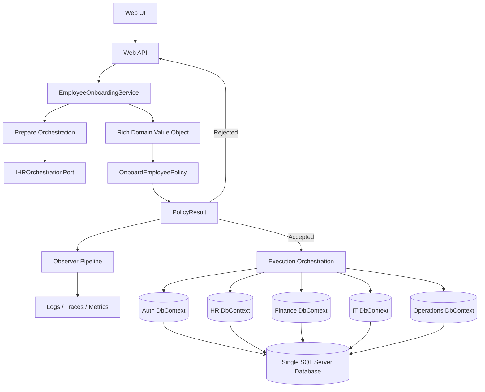

# DataArc Orchestration Framework Demo

A public, end-to-end demonstration of **use-case-oriented orchestration in .NET**.

This repository shows how DataArc can keep business policy, application coordination, persistence mechanics, observability, and presentation concerns separate without requiring every use case to grow into a collection of repositories, handlers, commands, queries, and persistence-aware services.

The demo uses multiple EF Core `DbContext` boundaries over a single physical SQL Server database and coordinates one employee-onboarding use case across Identity, HR, Finance, IT, and Operations.

---

## Why use a dedicated orchestration layer?

The goal is not to remove architectural boundaries. The goal is to stop creating abstractions simply because a pattern says they must exist.

A dedicated orchestration layer helps avoid:

- **Repositories for repository's sake**
- **Repositories for every database or persistence permutation**
- **CQRS + command/query + handler proliferation where the use case does not need it**
- **Multiple command/query classes for every database-column or persistence permutation**
- **Handler and event-handler sprawl**
- **Application services that know too much about EF Core, transactions, connections, or save order**

Traditional application-layer plumbing can become surprisingly large when a single use case needs to read state, apply business rules, write to several persistence boundaries, emit events, and commit atomically.

DataArc takes a different approach:

> **A use case may query and command within the same explicit orchestrator when that is what the use case actually requires.**

The orchestrator coordinates persistence.  
The domain owns business rules.  
The application service coordinates the use case.  
Ports isolate the application from orchestration implementation.  
Observers provide logs, traces, metrics, and other reactions to domain decisions.

That keeps the code aligned with the business operation rather than forcing the business operation to align with a plumbing pattern.

---

## What this demo demonstrates

The employee-onboarding use case crosses five application persistence boundaries:

- **Auth** — resolves the existing Identity user
- **HR** — creates the employee and department relationship
- **Finance** — creates the payroll record
- **IT** — creates the access request
- **Operations** — creates the onboarding task

The use case is intentionally implemented as a single in-process, transactional workflow.

If the execution succeeds, the transaction commits once.

If a persistence or system failure occurs, the transaction is rolled back and the exception propagates as a technical failure.

Business rejection is handled earlier by domain policy and is **not** represented as a failed persistence operation.

---

## Architecture at a glance


```mermaid
flowchart TD
    UI[Web UI] --> API[Web API]
    API --> SERVICE[EmployeeOnboardingService]

    SERVICE --> PREP[Prepare Orchestration]
    PREP --> PORT[IHROrchestrationPort]

    SERVICE --> DOMAIN[Rich Domain Value Object]
    DOMAIN --> POLICY[OnboardEmployeePolicy]

    POLICY --> RESULT[PolicyResult]
    RESULT --> OBS[Observer Pipeline]
    OBS --> TELEMETRY[Logs / Traces / Metrics]

    RESULT -->|Accepted| EXEC[Execution Orchestration]
    RESULT -->|Rejected| API

    EXEC --> AUTH[(Auth DbContext)]
    EXEC --> HR[(HR DbContext)]
    EXEC --> FIN[(Finance DbContext)]
    EXEC --> IT[(IT DbContext)]
    EXEC --> OPS[(Operations DbContext)]

    AUTH --> DB[(Single SQL Server Database)]
    HR --> DB
    FIN --> DB
    IT --> DB
    OPS --> DB
```

The important boundary is:

```text
Application
    ↓
Port
    ↓
Orchestration
    ↓
Persistence
```

The application layer does not need to know about `DbContext`, shared SQL connections, transaction ownership, save order, rollback mechanics, or how many persistence boundaries participate in the use case.

---

## The application service stays thin

The service coordinates the use case without owning persistence mechanics or business rules.

Conceptually, the flow is:

```csharp
var preparedEmployee =
    await _hrOrchestration.PrepareEmployeeOnboardingAsync(...);

var policyContext =
    new OnboardEmployeePolicyContext(
        new OnBoardEmployeeValueObject(...));

var policyResult =
    _employeeOnboardingPolicy.Apply(policyContext);

await _observableEventHandler.DispatchAsync(
    policyResult.DomainEvents);

if (!policyResult.IsSuccess)
{
    return new OnboardEmployeeResponseDto
    {
        IsSuccess = false,
        FailureReason = policyResult.Message
    };
}

var output =
    await _hrOrchestration.OnboardEmployeeAsync(
        new OnboardEmployeeInput(...));

return new OnboardEmployeeResponseDto
{
    IsSuccess = true,
    EmployeeId = output.EmployeeId,
    PayrollRecordId = output.PayrollRecordId
};
```

There are three deliberately different outcomes:

```text
Validation failure
    → the request itself is invalid

Policy rejection
    → the request is valid, but a business rule rejects the operation

System / persistence failure
    → an exception propagates from execution
```

Those concepts are not collapsed into one generic "failed" path.

---

## Rich domain policy

The orchestration layer gathers facts. It does not decide whether onboarding is allowed.

Prepared persistence state is translated into a rich domain value object, and the policy makes the business decision.

Examples of policy decisions in the demo include:

- the Identity user must exist;
- the employee must not already be onboarded;
- an employee must not already exist for the selected Identity user;
- onboarding records must not already exist for the same workflow.

The value object gives persisted facts domain meaning, while the policy decides whether those facts permit the use case.

This keeps business rules out of:

- controllers/endpoints;
- persistence code;
- EF Core entities;
- orchestrators;
- application plumbing.

---

## Observation is part of the design

A policy decision is useful to more than the caller.

The demo dispatches the domain events produced by the policy:

```csharp
await _observableEventHandler.DispatchAsync(
    policyResult.DomainEvents);
```

Observers can then record the same business decision through:

- structured logs;
- traces;
- metrics;
- diagnostics;
- future auditing or integrations.

The UI receives the policy message, while Aspire/OpenTelemetry can expose the corresponding accepted or rejected decision operationally.

That means a business rejection is visible both to the user and to the system operator without duplicating the rule.

---

## Ports keep orchestration replaceable

The application depends on an orchestration port rather than directly on orchestration implementation details.

For HR onboarding that boundary is represented by:

```text
IHROrchestrationPort
```

The application asks for a use case to be prepared or executed.

It does not need to know:

- which `DbContext` is used;
- how many contexts participate;
- how connections are shared;
- how the transaction is created;
- which entity is saved first;
- how rollback is performed.

That makes orchestration an explicit application capability rather than persistence logic leaking into application services.

---

## Persistence orchestration

The execution orchestrator receives an already-approved instruction.

It does **not** decide:

- whether onboarding is allowed;
- whether the employee should exist;
- whether the user qualifies;
- what business rule should reject the operation.

It coordinates persistence.

The onboarding transaction creates:

```text
Employee
EmployeeDepartment
PayrollRecord
AccessRequest
OnboardingTask
```

The different EF Core contexts represent application boundaries while targeting the same physical relational database.

The orchestrator coordinates those boundaries using one local transaction and one final commit.

---

## Workflow values are supplied to execution

The orchestrator is not responsible for inventing business state such as:

```text
Employee onboarding status
Access level
Access-request status
Onboarding-task name
Onboarding-task status
Payroll activation
Effective date
Due date
```

Those values are supplied through the orchestration input.

The execution orchestrator persists the approved instruction rather than making new business decisions while saving it.

This makes future policy changes possible without redesigning the persistence workflow.

---

## This is an in-process workflow, not a durable workflow engine

The onboarding flow is intentionally simple:

```text
Prepare
    ↓
Policy
    ↓
Execute
    ↓
Commit
```

It does not currently provide:

- persisted workflow instances;
- checkpoint/resume;
- retry scheduling;
- long-running workflow state;
- compensation orchestration;
- process recovery after host termination.

The transaction either commits or rolls back.

Downstream records such as an access request or onboarding task may then continue through their own lifecycles independently.

For example:

```text
Employee onboarding: Completed
Access request: Requested
Onboarding task: Created
Payroll record: Active
```

`Completed` means the onboarding use case itself committed successfully. It does not imply that every downstream activity created by onboarding has already completed.

---

# Running the demo

## Prerequisites

You will need:

- the .NET SDK targeted by the solution;
- SQL Server;
- a connection string configured for the demo database;
- NuGet access to the DataArc packages referenced by the solution.

The web demo and the DDL Builder integration-test path intentionally have different setup stories.

---

## 1. Create the demo database

Before starting the application, run:

```text
setup/SetupDemoDatabase.sql
```

against your SQL Server instance.

The supplied SQL script is the supported setup path for running the Web API and Web UI demo.

The application intentionally fails fast when the demo database is unavailable rather than silently creating application infrastructure at runtime.

---

## 2. Configure the connection string

The persistence modules use the shared connection named:

```text
DataArcDemoDb
```

Update the relevant application settings for your SQL Server environment.

All five `DbContext` boundaries target the same physical demo database.

---

## 3. Start the Aspire application

Run the solution through the Aspire AppHost.

The Aspire dashboard is useful for this demo because the observer pipeline exposes policy decisions through application telemetry.

You can watch accepted and rejected onboarding decisions alongside the running services.

---

## 4. Import Identity users

Employee onboarding begins with an existing Identity user.

Use the **Import Users** feature in the demo UI to create demo Identity users before onboarding them.

The onboarding API accepts the Identity username rather than exposing the Identity database key as a public input contract.

The preparation orchestrator resolves that username to the persisted Identity user before policy evaluation.

---

## 5. Run employee onboarding

Open the employee-onboarding page and submit an existing Identity username.

The demo will:

1. resolve the Identity user;
2. gather onboarding state across the participating persistence boundaries;
3. build the domain policy context;
4. evaluate the onboarding policy;
5. dispatch accepted/rejected domain events to observers;
6. if accepted, execute the transactional persistence workflow;
7. create the related HR, Finance, IT, and Operations records;
8. commit once.

A policy rejection is surfaced to the UI as meaningful business information rather than as a generic validation message.

---

# Integration test and SQL Server tooling

The repository intentionally keeps the integration test small because it also serves as a product demonstration.

The integration-test setup exercises the commercial SQL Server tooling in:

```text
DataArc.EntityFrameworkCore.SqlServer
```

The test registers the complete demo and composes the physical database from multiple EF Core contexts.

Conceptually:

```csharp
var databaseBuilder =
    _databaseFactory.CreateDatabaseBuilder();

var demoDatabase =
    databaseBuilder
        .IncludeDbContext<AuthDbContext>()
        .IncludeDbContext<HrDbContext>()
        .IncludeDbContext<ItDbContext>()
        .IncludeDbContext<OperationsDbContext>()
        .IncludeDbContext<FinanceDbContext>()
        .Build(
            generateScripts: true,
            applyChanges: true);

demoDatabase.ExecuteDrop();
demoDatabase.ExecuteCreate();
```

This demonstrates:

- multi-`DbContext` relational composition;
- database creation through DataArc;
- generated SQL scripts;
- the complete onboarding workflow against a real SQL Server database.

> **Important:** the integration test is destructive by design. Point it at a dedicated disposable integration-test database, never at the database used by the running Web UI/API demo.

---

## Integration-test licensing

The Web UI demo can be started from the supplied SQL setup script.

The integration-test DDL Builder path is different: it demonstrates commercial SQL Server functionality and therefore requires a valid DataArc key or configured server key.

That separation is intentional:

```text
Web demo
    → supplied SQL script
    → no DDL Builder required for setup

Integration test
    → DataArc SQL Server DDL Builder
    → commercial key required
```

---

## Generated SQL scripts

The integration-test project keeps generated DDL scripts visible in the project structure.

Its project file includes:

```xml
<ItemGroup>
  <Folder Include="bin\Debug\net10.0\Scripts\" />
  <Folder Include="Database\Scripts\" />
</ItemGroup>
```

This allows the SQL generated by the DDL Builder to remain visible as part of the demonstration rather than disappearing into build output.

---

# Project responsibilities

## Demo.Application

Contains:

- feature services;
- domain policies;
- rich domain value objects;
- domain events;
- module registration;
- application contracts.

Application services coordinate use cases but do not perform EF Core persistence.

---

## Demo.Orchestration

Contains:

- orchestrator contracts;
- orchestrator inputs and outputs;
- orchestration ports/adapters;
- explicit persistence coordination.

This is where persistence workflow mechanics live.

It is deliberately separate from the application layer.

---

## Demo.Persistence

Contains:

- EF Core `DbContext` implementations;
- persistence models;
- persistence-module registration.

Each persistence boundary registers its own context factory while participating in the host-managed logging pipeline.

---

## Demo.WebApi

Maps application outcomes to HTTP semantics.

For example:

```text
Successful onboarding
    → 200 OK

Business-policy rejection
    → 422 Unprocessable Entity

Technical/system failure
    → exception / server error
```

The feature service itself does not depend on HTTP concepts.

---

## Demo.WebApp

Provides a simple UI for exercising the demo.

Its purpose is not to hide the architecture. It makes the architecture visible:

- import Identity users;
- trigger onboarding;
- see successful persisted outcomes;
- see meaningful policy rejections;
- compare UI behavior with Aspire logs, traces, and metrics.

---

# Why not repositories everywhere?

Repositories remain valid when they provide a meaningful domain abstraction.

This demo intentionally shows that they are **not required merely to create a persistence boundary**.

Without an explicit orchestration layer, a multi-context use case can easily produce:

```text
Application Service
    → Repository A
    → Repository B
    → Repository C
    → Command A
    → Command Handler A
    → Query B
    → Query Handler B
    → Event C
    → Event Handler C
    → Transaction coordination somewhere else
```

The use case becomes fragmented across plumbing classes.

DataArc instead permits the persistence workflow to remain explicit:

```text
Application
    → Domain policy
    → Port
    → Orchestrator
        → Query what the use case needs
        → Command what the use case needs
        → Coordinate persistence boundaries
        → Commit once
```

The important principle is not "never use repositories."

It is:

> **Do not create repositories, handlers, commands, or queries solely to satisfy architectural ceremony when an explicit use-case orchestrator expresses the operation more clearly.**

---

# Why not CQRS everywhere?

CQRS is valuable when separate read and write models solve an actual problem.

It becomes expensive when every small application interaction is mechanically decomposed into:

```text
Command
Command Handler
Query
Query Handler
Event
Event Handler
```

and then multiplied again for every persistence or column permutation.

The orchestration framework does not prohibit CQRS.

It simply does not require a use case to pretend that its reads and writes are unrelated when they belong to one coherent operation.

An orchestrator may query the state it needs and execute the commands required by the same approved use case.

---

# Reducing handler and event sprawl

Domain events remain useful in this demo.

The distinction is that events are used deliberately.

The onboarding policy emits an accepted or rejected domain event because that decision is valuable to observers.

The observer pipeline can then provide telemetry without turning every persistence step into another application handler.

This keeps events focused on meaningful domain or operational signals instead of using them as mandatory plumbing between every line of a use case.

---

# Failure semantics

The demo deliberately separates business failure from system failure.

## Business rejection

A valid request may still violate a business rule.

The domain policy returns a rejection and a meaningful reason.

That reason is visible to the caller, and the corresponding domain event is visible to observers.

## System failure

A SQL error, connection failure, unexpected persistence problem, or other technical failure is not converted into a fake business result.

The execution orchestrator rolls back the transaction and allows the exception to propagate.

This prevents technical failures from masquerading as domain decisions.

---

# Logging and telemetry

EF Core uses the host-managed `Microsoft.Extensions.Logging` pipeline.

Persistence modules do not create private static `LoggerFactory` instances.

Typed application/orchestration loggers, EF Core diagnostics, and observer telemetry therefore participate in the same host logging infrastructure and can be surfaced through Aspire/OpenTelemetry.

---

# Testing philosophy

The public integration test is intentionally small.

Its purpose is to prove the complete path and demonstrate the DataArc SQL Server tooling:

```text
Application service
    → Domain policy
    → Port
    → Orchestration
    → Multiple EF Core contexts
    → SQL Server
```

The demo avoids turning the test project into a testing-framework showcase.

The product and architectural flow remain the focus.

---

# DataArc components demonstrated

The repository demonstrates the roles of the DataArc stack:

### Orchestrator

Explicit input/output application orchestration without handler-per-message ceremony.

### Observer

In-process domain-event dispatch with a natural hook for logs, traces, metrics, auditing, and other reactions.

### EntityFrameworkCore

EF Core-oriented persistence capabilities used by the demo.

### EntityFrameworkCore.SqlServer

Commercial SQL Server functionality including the database-definition / DDL Builder path demonstrated by the integration test.

---

# Design principles demonstrated by the repository

The demo intentionally follows these rules:

1. **Business rules belong in the domain.**
2. **Persistence facts may inform policy, but persistence does not make policy decisions.**
3. **Application services coordinate; they do not become persistence layers.**
4. **Ports isolate the application from orchestration implementation.**
5. **Execution orchestrators coordinate persistence and do not invent business rules.**
6. **Business rejection and technical failure are different concepts.**
7. **Observers react to domain decisions without coupling telemetry to policy.**
8. **Multiple `DbContext` boundaries do not require repository proliferation.**
9. **Queries and commands may coexist in one orchestrator when they are part of one coherent use case.**
10. **Architecture should reduce plumbing, not manufacture it.**

---

# Current demo scope

The repository is deliberately focused.

It demonstrates one clear cross-module use case well rather than attempting to become:

- a generic workflow engine;
- a repository framework;
- a CQRS framework;
- a mediator replacement for every message in the application;
- a complete HR system.

The point is to show how explicit orchestration, domain policy, observation, and persistence boundaries can work together while keeping the application understandable.

---

## Final thought

The orchestration layer is not there to move business logic out of the domain.

It is there to give **cross-boundary execution mechanics a proper home**.

That leaves each layer with a clearer job:

```text
Domain
    → decides

Application
    → coordinates

Observation
    → reacts and records

Orchestration
    → executes the approved persistence workflow

Persistence
    → stores state

Presentation
    → communicates outcomes
```

That is the architecture this demo is intended to make visible.
