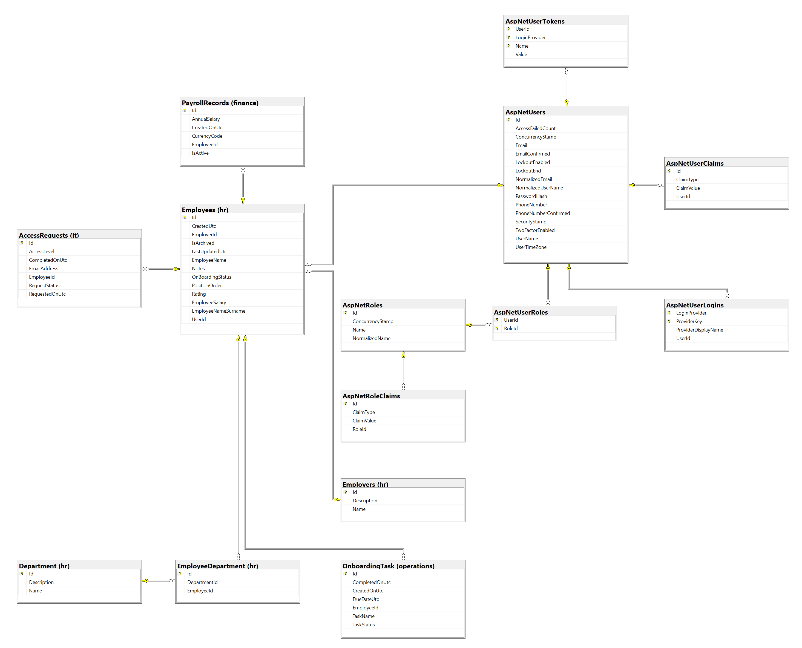

# DataArc Orchestration Framework Demo

> **Model the business operation, not the plumbing required to implement it.**

This repository is a public reference implementation showing how a modular .NET application can coordinate a single business use case across multiple domain and persistence boundaries without turning the application layer into a collection of repository, command/query, service, and handler plumbing.

The demo uses a realistic employee-onboarding scenario spanning:

- ASP.NET Core Identity
- Human Resources
- Finance
- IT
- Operations

The application is hosted with **.NET Aspire**, persisted with **EF Core and SQL Server**, and coordinated in-process with the **DataArc Orchestration Framework**.

The central architectural idea is simple:

> **A `DbContext` boundary does not have to become a relational boundary.**

---

## Why this architecture?

### One business use case can legitimately span multiple domains

Employee onboarding is owned by HR, but the consequences of onboarding do not belong exclusively to HR.

When HR onboards a person:

- HR creates the employee and department relationship.
- Finance needs a payroll record.
- IT needs an access request.
- Operations needs onboarding work to be created.

Without an explicit orchestration boundary, this kind of workflow can easily become:

```text
HR creates Employee
    ↓
call Finance service
    ↓
call IT service
    ↓
call Operations service
    ↓
hope all of the pieces remain consistent
```

The demo instead models onboarding as one explicit business use case:

```text
HR starts employee onboarding
        ↓
prepare current application state
        ↓
evaluate business policy
        ↓
execute the approved workflow
        ↓
HR + Finance + IT + Operations
        ↓
commit one coordinated local transaction
```

HR does not become Finance, IT, or Operations.

It owns the **business event** that causes those domains to participate.

---

## Explicit workflows without handler sprawl

The onboarding use case does not require:

- a repository for every table
- a service mirroring every entity
- a command and handler for every insert
- a query and handler for every read
- a mediator pipeline for every small operation
- cross-module repositories injected into HR
- persistence mechanics scattered throughout the application layer

Instead, the application remains use-case oriented:

```text
EmployeeOnboardingService
        ↓
IHROrchestrationPort
        ↓
PrepareEmployeeOnboardingOrchestrator
        ↓
OnboardEmployeePolicy
        ↓
DataArc Observer
        ↓
OnboardEmployeeOrchestrator
```

The service composes the use case.

The policy decides whether the business operation is allowed.

The orchestrators gather and coordinate the persistence work required by that use case.

Observers react to meaningful domain events.

---

## Preserve module boundaries without giving up relational integrity

The demo uses five separate EF Core contexts:

```text
AuthDbContext
HrDbContext
FinanceDbContext
ItDbContext
OperationsDbContext
```

Those contexts remain distinct application and persistence boundaries.

They are nevertheless composed into one physical SQL Server relational model:

```text
dbo.AspNetUsers
      │
      │ UserId
      ▼
hr.Employees
      │
      ├──► hr.EmployeeDepartment ───► hr.Department
      │
      ├──► finance.PayrollRecords
      │
      ├──► it.AccessRequests
      │
      └──► operations.OnboardingTask
```

SQL Server, not application convention, enforces the relationships.

The most important example is the relationship between ASP.NET Core Identity and HR:

```text
dbo.AspNetUsers.Id
        │
        │ FOREIGN KEY
        ▼
hr.Employees.UserId
```

`AuthDbContext` and `HrDbContext` remain independent EF Core models while the physical database still retains real relational integrity between them.

That composition is the commercial capability demonstrated by `DataArc.EntityFrameworkCore.SqlServer`.

---

## Modularity without committing to microservices

The architecture deliberately preserves module ownership before requiring a distributed architecture.

Today the onboarding workflow runs in-process:

```text
OnboardEmployeeOrchestrator
    ├── HrDbContext
    ├── FinanceDbContext
    ├── ItDbContext
    └── OperationsDbContext

              ↓

      one SQL Server database
      one local transaction
```

If those modules are later extracted into services, the business process does not need to be rediscovered.

The boundaries, policies, ports, contracts, and use-case ownership are already explicit.

The implementation can evolve toward:

```text
Employee onboarding process
    ├── HR service
    ├── Finance service
    ├── IT service
    └── Operations service
```

The transaction model would change.

A distributed version would require appropriate messaging or APIs, eventual consistency, idempotency, retries, failure handling, and potentially compensating actions.

The architecture does **not** make distributed systems free.

It does avoid having to first untangle a monolith simply to discover where the business workflow lives.

---

## Separate business decisions, execution, and reactions

The demo deliberately separates three concerns.

### Policy — decide

```text
Can this user be onboarded?
Has the employee already been onboarded?
Do onboarding records already exist?
```

The domain policy makes those decisions without knowing how data will be persisted.

### Orchestrator — execute

The orchestrator owns technical workflow mechanics such as:

- creating `DbContext` instances
- gathering data across persistence boundaries
- coordinating the shared SQL connection
- transaction participation
- persistence ordering
- commit and rollback

### Observer — react

Domain events are dispatched without making the domain depend on logging, telemetry, or other infrastructure.

Observers provide the translation point from a domain event into operational concerns such as:

- structured logging
- traces
- metrics
- auditing
- future secondary reactions

The demo uses this seam to surface HR policy telemetry through OpenTelemetry and the Aspire dashboard.

---

# What is free and what is commercial?

This repository is primarily a public architecture and engineering demonstration.

Most of the application shown here is deliberately available without requiring a commercial DataArc license.

## Free / public demonstration

The demo uses and exposes:

- DataArc application orchestration
- DataArc observers
- domain policies and events
- ports and adapters
- DataArc EF Core bulk execution
- ASP.NET Core
- ASP.NET Core Identity
- EF Core
- .NET Aspire
- the complete demo architecture and source

The user-import workflow demonstrates the free `DataArc.EntityFrameworkCore` bulk execution surface.

## Commercial capability

The commercial capability demonstrated by this repository is:

```text
DataArc.EntityFrameworkCore.SqlServer
```

Its role in this demo is the composition of independent EF Core models into a physical SQL Server relational model.

That includes the ability to compose:

```text
AuthDbContext
HrDbContext
FinanceDbContext
ItDbContext
OperationsDbContext
```

into a database containing relationships such as:

```text
hr.Employees.UserId
        ↓
dbo.AspNetUsers.Id
```

and:

```text
finance.PayrollRecords.EmployeeId
it.AccessRequests.EmployeeId
operations.OnboardingTask.EmployeeId
        ↓
hr.Employees.Id
```

The repository includes the generated SQL setup so the running demo can be evaluated without requiring a commercial license.

Regenerating the composed database through the DataArc SQL Server DDL Builder, and running the integration path that exercises that commercial tooling, requires a valid `DataArc.EntityFrameworkCore.SqlServer` license.

---

# Solution architecture

```text
┌──────────────────────────── .NET Aspire ─────────────────────────────┐
│                                                                     │
│   Demo.Host.Aspire.Web                      Demo.WebApi              │
│   Razor Components                              │                   │
│          │                                      │                   │
│          └────────────── HTTP ─────────────────►│                   │
│                                                 │                   │
│                                                 ▼                   │
│                                  Application use-case service        │
│                                                 │                   │
│                                                 ▼                   │
│                                      Orchestration port              │
│                                                 │                   │
│                         ┌───────────────────────┴────────────────┐   │
│                         │                                        │   │
│                         ▼                                        │   │
│              Prepare onboarding state                            │   │
│                         │                                        │   │
│                         ▼                                        │   │
│                    Domain policy                                 │   │
│                         │                                        │   │
│                         ├────► Domain events ─────► Observers     │   │
│                         │                              │          │   │
│                         ▼                              ▼          │   │
│               Onboarding orchestrator           OpenTelemetry    │   │
│                         │                              │          │   │
│       ┌─────────────────┼─────────────────┐            │          │   │
│       ▼                 ▼                 ▼            ▼          │   │
│      HR              Finance             IT       Aspire Dashboard│   │
│       │                                   │                       │   │
│       └──────────────── Operations ────────┘                       │   │
│                         │                                         │   │
│                         ▼                                         │   │
│              SQL Server relational database                       │   │
│                                                                     │
└─────────────────────────────────────────────────────────────────────┘
```

---

# How the application works

## 1. Database setup

The demo uses a SQL Server database named:

```text
DataArcOrchestrationDemo
```

The default API connection string is configured in:

```text
src/Presentation/Demo.WebApi/appsettings.json
```

The supplied default is:

```text
Server=.;
Database=DataArcOrchestrationDemo;
Integrated Security=SSPI;
TrustServerCertificate=True;
MultipleActiveResultSets=True
```

Update this connection string for your SQL Server environment before running the demo.

The physical database is deliberately created from the generated SQL rather than being silently created when the application starts.

The generated SQL is currently embedded in:

```text
src/Presentation/Demo.Host.Aspire.Web/
Components/Pages/DemoSetup.razor.cs
```

inside the `SqlScript` property.

Execute that script against SQL Server before the first full application launch.

The script creates:

- the database
- ASP.NET Core Identity tables
- the `hr` schema
- the `finance` schema
- the `it` schema
- the `operations` schema
- business tables
- relational foreign keys across the composed model

The demo UI also exposes the script on the **Demo Setup** page for inspection and copying.

The application does **not** recreate the database on every startup.

---

## 2. Reference data is seeded on startup

Once the schema exists, the Web API starts an idempotent database seeder.

The seeder ensures that the demo contains:

```text
Employer
    SolidArcSoftware

Department
    Information Technology
```

The seeder deliberately does **not** create:

```text
AspNetUsers
Employees
EmployeeDepartment
PayrollRecords
AccessRequests
OnboardingTask
```

Those records are created by the demo workflows themselves.

This keeps the demo state meaningful:

```text
database structure
        ↓
reference data
        ↓
import users
        ↓
onboard selected users
```

---

## 3. Import Identity users

The first visible workflow is:

```text
Auth
    ↓
Import Users
```

From the UI, select:

```text
Auth → Import Users
```

or call:

```text
POST /api/auth/imports
```

No request body is required.

The application generates 100,000 ASP.NET Core Identity users and imports them through the DataArc EF Core bulk execution path.

Conceptually:

```text
Generate Identity users
        ↓
DataArc bulk operation
        ↓
dbo.AspNetUsers
```

The imported records are **users only**.

They are not employees yet.

No HR, Finance, IT, or Operations records are created during the import.

This distinction is central to the demo.

---

## 4. Select an Identity user for onboarding

Employee onboarding starts from an existing Identity `UserId`.

Example:

```json
{
  "userId": 1,
  "annualSalary": 85000,
  "currencyCode": "USD",
  "reason": "Demo employee onboarding"
}
```

The endpoint is:

```text
POST /api/hr/onboarding
```

At this point:

```text
dbo.AspNetUsers
    contains UserId = 1

hr.Employees
    does not yet contain an Employee for UserId = 1
```

The employee is created **by onboarding**.

---

## 5. Prepare the onboarding state

The application service first calls:

```text
PrepareEmployeeOnboardingOrchestrator
```

This orchestrator is a read-oriented orchestration step.

It is allowed to coordinate multiple `DbContext` boundaries because the application reaches it through an explicit orchestration port.

It gathers the state required by the business policy from:

```text
AuthDbContext
HrDbContext
FinanceDbContext
ItDbContext
OperationsDbContext
```

For a newly imported user, the expected state is:

```text
User exists               true
Employee exists           false
Department relationship   false
Payroll record exists     false
Access request exists     false
Onboarding task exists    false
```

The orchestrator does not make the business decision.

It gathers the facts required to make that decision.

---

## 6. Apply the HR onboarding policy

The application service creates an:

```text
OnboardEmployeePolicyContext
```

and applies:

```text
IEmployeeOnboardingPolicy
```

The policy owns the business decision.

It can reject the operation if the current state indicates that onboarding should not proceed.

The policy returns a `PolicyResult` containing:

- success or failure
- a business message
- domain events

Example domain events include:

```text
OnboardEmployeeAcceptedEvent
OnboardEmployeeRejectedEvent
```

The policy knows nothing about SQL Server, EF Core transactions, Aspire, logging, or telemetry.

---

## 7. Dispatch domain events

The application dispatches the events returned by the policy through DataArc Observer.

```text
Policy
    ↓
Domain event
    ↓
IObservableEventHandler
    ↓
IEventObserver<TEvent>
```

Observers provide the application with an extensible reaction mechanism without turning those reactions into dependencies of the domain policy.

The HR observer layer is also where domain events can be translated into operational telemetry.

The demo registers:

```text
ActivitySource: Demo.HR
Meter:          Demo.HR
```

with Aspire's OpenTelemetry configuration.

This allows domain-level events to be correlated with the HTTP request and viewed alongside normal application telemetry in the Aspire dashboard.

---

## 8. Execute the approved onboarding workflow

If the policy accepts the request, the application invokes:

```text
OnboardEmployeeOrchestrator
```

The orchestrator starts from the selected Identity `UserId`.

It then:

```text
Create hr.Employee
        │
        └── UserId → dbo.AspNetUsers.Id
        ↓
obtain generated EmployeeId
        ↓
Create hr.EmployeeDepartment
        ↓
Create finance.PayrollRecord
        ↓
Create it.AccessRequest
        ↓
Create operations.OnboardingTask
```

The generated `EmployeeId` becomes the relational key used by the downstream modules.

---

## 9. Coordinate one local transaction

The onboarding orchestrator creates:

```text
HrDbContext
FinanceDbContext
ItDbContext
OperationsDbContext
```

The HR context owns the SQL connection and local transaction.

The other contexts participate using the same connection and transaction.

Persistence is performed sequentially against that shared connection.

The workflow commits only after every participating context has completed successfully.

If a database operation fails, the transaction is rolled back.

```text
BEGIN TRANSACTION
        ↓
create Employee
        ↓
create EmployeeDepartment
        ↓
create PayrollRecord
        ↓
create AccessRequest
        ↓
create OnboardingTask
        ↓
COMMIT
```

or:

```text
any database failure
        ↓
ROLLBACK
```

### Important transaction note

The runtime onboarding transaction in this demo uses normal EF Core local transaction APIs.

The commercial DataArc SQL Server capability being demonstrated here is the **relational model composition and DDL generation**, not a replacement for EF Core's normal transaction APIs.

---

## 10. Retry the same user

Attempting to onboard the same user again exercises the policy-rejection path.

The flow becomes:

```text
UserId
    ↓
PrepareEmployeeOnboardingOrchestrator
    ↓
existing onboarding state discovered
    ↓
OnboardEmployeePolicy
    ↓
Rejected
    ↓
OnboardEmployeeRejectedEvent
    ↓
Observer
    ↓
structured telemetry
```

The API returns the expected business rejection rather than silently creating another complete onboarding workflow.

---

# Aspire and DataArc have different responsibilities

The repository deliberately contains two different kinds of orchestration.

## .NET Aspire

Aspire operates **around the applications**.

It provides:

- application hosting
- service discovery
- health checks
- HTTP resilience
- logs
- metrics
- traces
- the Aspire dashboard

## DataArc

DataArc operates **inside the application process**.

It provides the application-level structure for:

- explicit use cases
- orchestration contracts
- orchestrators
- observers
- domain-event reactions
- coordinated persistence flows

Aspire does not replace application orchestration.

DataArc does not replace application hosting or observability infrastructure.

They solve different problems and work together.

---

# Composed relational model

The database uses the following logical ownership:

```text
dbo
    ASP.NET Core Identity

hr
    Employers
    Employees
    Department
    EmployeeDepartment

finance
    PayrollRecords

it
    AccessRequests

operations
    OnboardingTask
```

The resulting relational model preserves foreign keys across those boundaries.

```text
dbo.AspNetUsers
       │
       ▼
hr.Employees
       │
       ├──────────────► finance.PayrollRecords
       │
       ├──────────────► it.AccessRequests
       │
       ├──────────────► operations.OnboardingTask
       │
       ▼
hr.EmployeeDepartment
       │
       ▼
hr.Department

hr.Employers
       │
       ▼
hr.Employees
```

The database diagram used by the demo is available at:

```text
src/Presentation/Demo.Host.Aspire.Web/wwwroot/images/ERD.png
```



---

# DataArc SQL Server DDL composition

The integration setup demonstrates the commercial database-composition surface.

The builder combines the EF Core metadata from:

```csharp
AuthDbContext
HrDbContext
ItDbContext
OperationsDbContext
FinanceDbContext
```

into one physical database definition.

Conceptually:

```csharp
var demoDatabase = databaseBuilder
    .IncludeDbContext<AuthDbContext>()
    .IncludeDbContext<HrDbContext>()
    .IncludeDbContext<ItDbContext>()
    .IncludeDbContext<OperationsDbContext>()
    .IncludeDbContext<FinanceDbContext>()
    .Build(
        generateScripts: true,
        applyChanges: true);
```

The resulting DDL can describe relationships that span otherwise independent `DbContext` models.

That is the important commercial distinction.

Creating a SQL Server database is not itself unusual.

Composing independent EF Core models — including ASP.NET Core Identity — into one database-enforced relational graph is the capability being demonstrated.

---

# Running the demo

## Requirements

You need:

- .NET 10
- SQL Server
- a SQL Server connection available to the Web API
- the DataArc NuGet dependencies referenced by the solution

## Step 1 — Configure SQL Server

Update:

```text
src/Presentation/Demo.WebApi/appsettings.json
```

and configure:

```text
ConnectionStrings:DataArcDemoDb
```

for your SQL Server environment.

## Step 2 — Create the demo database

Before the first full Aspire launch, execute the generated SQL setup script.

The current source for that script is:

```text
src/Presentation/Demo.Host.Aspire.Web/
Components/Pages/DemoSetup.razor.cs
```

Copy and execute the `SqlScript` value against SQL Server.

The script begins with:

```sql
CREATE DATABASE [DataArcOrchestrationDemo];
```

If the database already exists and you want a clean demo, remove/reset the demo database before running the script again.

## Step 3 — Start the Aspire AppHost

Run:

```text
src/Host/Demo.Host.Aspire/
Demo.Host.Aspire.AppHost/
Demo.Host.Aspire.AppHost.csproj
```

Aspire starts:

```text
apiservice
webfrontend
```

The frontend uses Aspire service discovery to communicate with the API.

## Step 4 — Import users

Open:

```text
Auth → Import Users
```

The demo imports 100,000 Identity users.

## Step 5 — Onboard a user

Open:

```text
Human Resources → Onboarding
```

Select an imported `UserId` and submit the onboarding workflow.

## Step 6 — Inspect the result

Inspect the relational database and observe records in:

```text
dbo.AspNetUsers
hr.Employees
hr.EmployeeDepartment
finance.PayrollRecords
it.AccessRequests
operations.OnboardingTask
```

## Step 7 — Exercise a policy rejection

Submit the same `UserId` again.

The request should be rejected by the onboarding policy rather than creating a second complete onboarding workflow.

## Step 8 — Inspect Aspire telemetry

Open the Aspire dashboard and inspect:

- API requests
- logs
- traces
- HR policy telemetry
- correlated trace IDs

When using Swagger directly, use the **HTTPS** API endpoint exposed by Aspire.

---

# Integration tests

The integration tests exercise the complete module registration and database-composition path.

They:

```text
build the application service container
        ↓
use the DataArc SQL Server database builder
        ↓
drop and recreate the integration database
        ↓
seed the minimum test state
        ↓
resolve IEmployeeOnboardingService
        ↓
execute the real onboarding use case
```

The test intentionally calls the real application service rather than recreating the workflow inside the test.

## Commercial license requirement

The integration database setup exercises:

```text
DataArc.EntityFrameworkCore.SqlServer
```

and therefore requires a valid commercial license.

The normal runtime demo can instead use the supplied generated SQL and does not require the evaluator to regenerate the relational model.

Do not commit a real license key to the repository.

## Database safety

The integration-test database should always use a database name dedicated to tests because the setup explicitly drops and recreates that database.

Never point the integration tests at a database containing demo or production data.

---

# Project structure

```text
src
│
├── App
│   ├── Demo.Application.Domain
│   ├── Demo.Application.Domain.SharedKernel
│   ├── Demo.Application.Features
│   └── Demo.Application.Modules
│
├── Orchestration
│   └── Demo.Orchestration
│       ├── Auth
│       └── HR
│
├── Infrastructure
│   └── Demo.Persistence
│       ├── Database
│       ├── Modules
│       └── Utils
│
├── Presentation
│   ├── Demo.Host.Aspire.Web
│   └── Demo.WebApi
│
└── Host
    └── Demo.Host.Aspire
        ├── Demo.Host.Aspire.AppHost
        └── Demo.Host.Aspire.ServiceDefaults

tests
└── Demo.Integration.Tests
```

---

# Design rules demonstrated by the repository

The demo intentionally follows these rules:

**Policies decide.**

Business rules determine whether a workflow may proceed.

**Application services compose use cases.**

They gather the required state, invoke policies, dispatch events, and call the appropriate orchestration port.

**Ports isolate the application from orchestration mechanics.**

The application does not directly construct or invoke concrete orchestrators.

**Orchestrators coordinate persistence boundaries.**

They may read from or write across several `DbContext` boundaries when the business use case legitimately spans those boundaries.

**Observers react.**

They translate domain events into secondary operational concerns without making the domain depend on those concerns.

**EF Core remains EF Core.**

DataArc augments EF Core rather than hiding it behind a replacement persistence abstraction.

**Aspire remains infrastructure orchestration.**

Application hosting and observability remain separate from application workflow orchestration.

---

# Package model

The demo currently references DataArc 2.0.0 packages.

## DataArc.OrchestrationFramework

Used for explicit application orchestration and observers.

```xml
<PackageReference
    Include="DataArc.OrchestrationFramework"
    Version="2.0.0" />
```

## DataArc.EntityFrameworkCore

Used for the free EF Core bulk execution demonstrated by Identity user import.

```xml
<PackageReference
    Include="DataArc.EntityFrameworkCore"
    Version="2.0.0" />
```

## DataArc.EntityFrameworkCore.SqlServer

Commercial SQL Server tooling used for relational model composition and DDL generation across multiple EF Core models.

```xml
<PackageReference
    Include="DataArc.EntityFrameworkCore.SqlServer"
    Version="2.0.0" />
```

---

# What the demo is really showing

This repository is not trying to prove that another framework can create a database or wrap `DbContext`.

It is demonstrating that a .NET application can:

- retain explicit domain and `DbContext` boundaries
- coordinate one business use case across several modules
- avoid repository-per-table and handler-per-operation plumbing
- keep business rules separate from execution mechanics
- react to domain events without coupling policies to infrastructure
- retain real SQL Server relational integrity across EF Core context boundaries
- remain a modular monolith today
- preserve a credible path toward independently deployed services later

without pretending that every module has to become a microservice on day one.

---

# Links

- **DataArc:** https://www.dataarc.dev
- **GitHub:** https://github.com/SolidArcSoftware/DataArc.Orchestration.Framework
- **Solid Arc Software:** https://github.com/SolidArcSoftware
- **NuGet — DataArc.OrchestrationFramework:** https://www.nuget.org/packages/DataArc.OrchestrationFramework
- **NuGet — DataArc.EntityFrameworkCore:** https://www.nuget.org/packages/DataArc.EntityFrameworkCore
- **NuGet — DataArc.EntityFrameworkCore.SqlServer:** https://www.nuget.org/packages/DataArc.EntityFrameworkCore.SqlServer

---

## In one sentence

> **Keep business workflows explicit, keep module boundaries intact, and let those boundaries participate in one relational model when the architecture requires it.**

Built by **Solid Arc Software**.